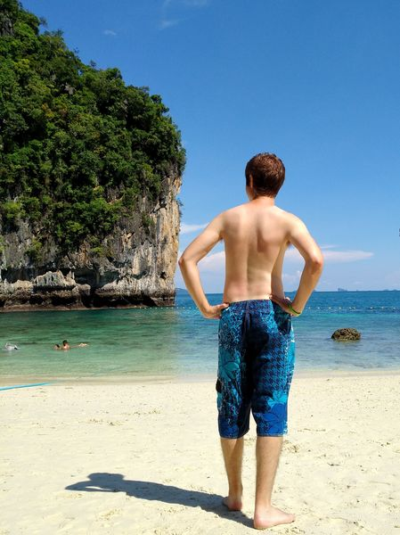
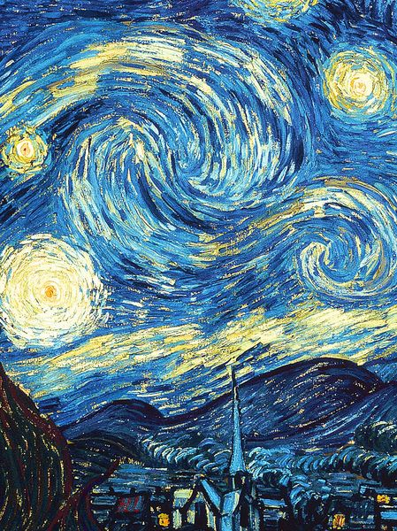
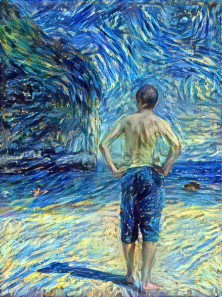
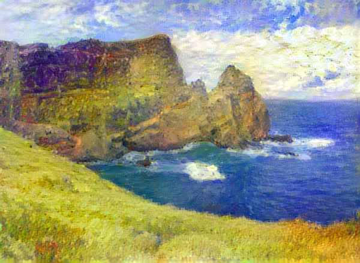
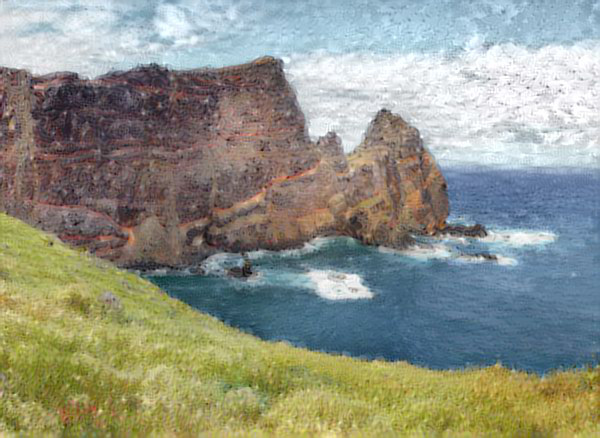
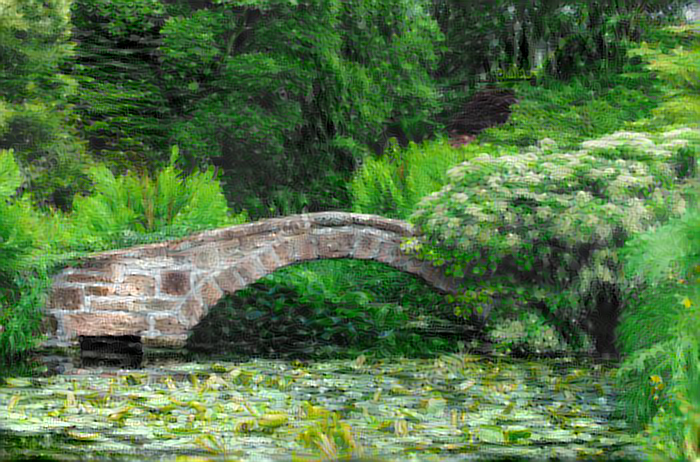
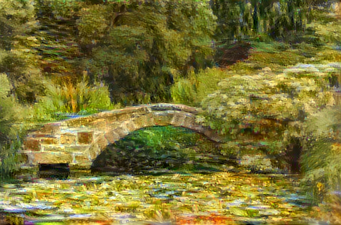
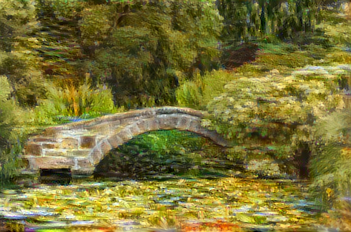

# Neural Style Transfer

Me trying out the techniques described by [Gatys et al.](https://arxiv.org/abs/1508.06576). I played around with the code from a [tensorflow 2.0 tutorial](https://www.tensorflow.org/beta/tutorials/generative/style_transfer) and added an additional feature to [preserve the color of the content image](https://arxiv.org/abs/1606.05897). Some images below.

Content | Style | Result
:--:|:---:|:---:
  |   | 

Preserving the color of the original image is useful when the algorithm places colors that don't really match the content, e.g. green rocks.

Non-Color-preserved | Color-preserved
|:---:|:---:
 | 

We can use the color of the style image to add an additional flair. In many cases, mixing parts by hand of the color-preserved stylized image and non-color-preserved stylized image in an image manipulation program (e.g. GIMP) yields the best results.

Color-preserved | Non-color-preserved | Mix by hand
:--:|:---:|:---:
  |   | 